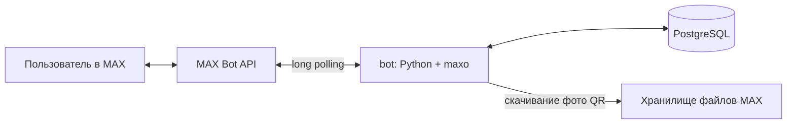

# <Название проекта> — аренда коммерческих помещений в MAX

Чат-бот в мессенджере MAX для поиска и сдачи в аренду коммерческих помещений. Площадка ориентирована только на бизнес: предприниматели ищут помещение под офис, общепит, торговлю или склад, а владельцы размещают объекты с документами и ограничениями прямо в карточке.

**Бот в MAX:** https://max.ru/t678_hakaton_max_bot
**Трек:** Эффективный бизнес

---

## Назначение решения

Перед открытием новой точки предприниматель выбирает помещение. Параметры, документы (планировка, требования города или округа, ограничения по помещению) обычно выясняются только после звонков и просмотров. Объекты с вывесок «Сдаётся» вообще нельзя посмотреть и сравнить онлайн.

Решение позволяет:

- **арендатору** — смотреть объекты по городам, открыть карточку с ценой, описанием, фото и ссылкой на документы, сохранить объект в избранное и связаться с владельцем;
- **владельцу** — за несколько шагов разместить объект, приложить документы и получить QR-код объекта для печати на вывеску;
- **любому прохожему** — загрузить QR-код с вывески в MAX-бота и сразу открыть карточку объекта.

---

## Основной пользовательский сценарий

1. **Владелец** регистрируется (имя, телефон, город) и создаёт объект: город → адрес → описание → фото → ссылка на облако с документами → цена → подтверждение.
2. Владелец открывает свой объект и получает **QR-код**, который можно разместить на вывеске.
3. **Арендатор** регистрируется, открывает «Смотреть объекты» и либо выбирает город и объект из списка, либо через «Быстрый поиск» сканирует QR-код или вводит ID объекта.
4. Арендатор видит карточку объекта с документами и контактом владельца, добавляет объект в избранное и связывается с владельцем.

---

## Состав и архитектура

Решение состоит из двух компонентов:

`bot`: Python-приложение чат-бота. Получает события из MAX Bot API, обрабатывает сценарии, работает с БД 
`db`: PostgreSQL — хранение пользователей, объектов и избранного 



### Структура репозитория

```
.
├── main.py                     # точка входа: запуск бота, подключение middleware и роутера
├── config.py                   # чтение переменных окружения, настройка логов
├── bot/
│   ├── handlers/user_handlers.py   # все сценарии: регистрация, меню, объекты, поиск, избранное
│   ├── keyboards/user_keyboards.py # inline-клавиатуры
│   ├── states/user_states.py       # состояния FSM
│   └── middlewares/db.py           # открывает сессию БД на каждое событие
├── data/
│   ├── database.py             # подключение к PostgreSQL (SQLAlchemy async)
│   ├── models.py               # модели User, Place, SavedObject
│   └── crud.py                 # операции с БД
├── utils/
│   ├── parsers.py              # валидация ввода, нормализация телефона, экранирование Markdown
│   └── utils.py                # скачивание вложений, генерация и чтение QR-кодов
├── alembic/                    # миграции схемы БД
├── alembic.ini
├── requirements.txt
├── Dockerfile
├── compose.yaml
├── .dockerignore
└── .env.example
```

### Стек

- Python 3.14
- [maxo](https://pypi.org/project/maxo/) — библиотека для MAX Bot API
- SQLAlchemy 2 (async) + asyncpg, Alembic — работа с БД и миграции
- qrcode — генерация QR-кодов, OpenCV — распознавание QR-кодов с фото
- PostgreSQL 18

---

## Быстрый запуск

1. Скопируйте файл окружения и укажите токен бота:

   ```bash
   cp .env.example .env
   # откройте .env и заполните BOT_TOKEN и параметры БД
   ```

2. Запустите все компоненты **одной командой**:

   ```bash
   docker compose up -d --build
   ```

При старте контейнер `bot` дожидается готовности PostgreSQL, применяет миграции (`alembic upgrade head`) и запускает бота. Убедиться, что бот работает:

```bash
docker compose logs -f bot
```

В логах должны появиться строки `База данных инициализирована.` и `Бот запущен.`

---

## Необходимые параметры окружения

- Docker 24+ и Docker Compose v2
- Доступ в интернет из контейнера `bot` (к MAX Bot API)
- Токен чат-бота MAX (выдаётся организаторами хакатона)

---

## Переменные окружения

Все переменные задаются в файле `.env` (шаблон — `.env.example`). Рабочие значения в репозиторий не добавляются.

| Переменная | Обязательна | Описание | Пример |
|---|---|---|---|
| `BOT_TOKEN` | да | Токен чат-бота MAX | — |
| `DB_USER` | да | Пользователь PostgreSQL | `bot` |
| `DB_PASSWORD` | да | Пароль PostgreSQL | `change_me` |
| `DB_HOST` | да | Хост БД. При запуске через Docker — имя сервиса | `db` |
| `DB_PORT` | да | Порт БД | `5432` |
| `DB_NAME` | да | Имя базы данных | `rent_bot` |

---

## Используемые порты

| Сервис | Порт | Доступ |
|---|---|---|
| `db` | `5432` | Только внутри сети Docker Compose, наружу не публикуется |
| `bot` | — | Входящих портов не открывает: события получает через long polling |

---

## Зависимости

Все Python-зависимости с зафиксированными версиями перечислены в `requirements.txt`. Основные:

| Пакет | Для чего |
|---|---|
| `maxo` | Работа с MAX Bot API |
| `SQLAlchemy`, `asyncpg` | Асинхронная работа с PostgreSQL |
| `alembic` | Миграции схемы БД |
| `aiohttp` | Скачивание вложений |
| `qrcode`, `pillow` | Генерация QR-кодов |
| `opencv-python-headless`, `numpy` | Распознавание QR-кодов на фото |
| `python-dotenv` | Загрузка переменных окружения |

---

## Внешние сервисы и интеграции

| Сервис | Как используется | Можно ли воспроизвести в Docker |
|---|---|---|
| **MAX Bot API** | Получение событий и отправка сообщений, клавиатур, фото | Нет. Нужен действующий токен бота и доступ в интернет |
| **Хранилище файлов MAX** | Скачивание фото из сообщений (для распознавания QR-кода) | Нет, доступно через MAX |
| **PostgreSQL** | Хранение данных | Да, сервис `db` |

Интеграций с государственными информационными системами (Росреестр, реестры МСП, портал КНД) в MVP нет. Документы и ограничения по объекту владелец прикладывает сам в виде ссылки на облако.

---

## Работа с данными

### Схема БД

| Таблица | Поля | Назначение |
|---|---|---|
| `users` | `id` (ID пользователя MAX), `name`, `user_name`, `phone_number`, `city`, `creation_date` | Профиль пользователя |
| `places` | `id`, `user_id` → `users.id`, `city`, `address`, `cost`, `description`, `photo`, `url_documents`, `creation_date` | Объекты для аренды |
| `saved_objects` | `id`, `object_id` → `places.id`, `user_id` → `users.id` | Избранное пользователей |

### Как хранятся данные

- **Фото объектов** хранятся как токены вложений MAX (через запятую в поле `photo`). Сами изображения остаются на стороне MAX, бот повторно отправляет их по токену.
- **Документы** — ссылка на внешнее облако, которую указал владелец. Если владелец ввёл `-`, документы не приложены.
- **QR-код** содержит строку `object:<ID>`, генерируется в памяти и отправляется пользователю, на диск не сохраняется.
- **Фото QR-кода**, присланное для поиска, временно сохраняется в папку `users_files/`, распознаётся и сразу удаляется.
- **Состояния диалогов** (FSM) хранятся в памяти процесса.

### Персональные данные

Бот хранит имя и телефон, которые пользователь указал при регистрации. Имя и телефон владельца показываются в карточке его объекта другим зарегистрированным пользователям — это основной способ связи. Пользователь предупреждается об этом в профиле.

### Ограничения ввода

- Текстовые поля — до 512 символов.
- Телефон нормализуется к виду `+7XXXXXXXXXX`.
- Цена — целое число.
- Фото объекта — до 5 изображений.
- Объектов на одного владельца — до 5.

---

## Тестовые данные

**В MVP нет заранее загруженных тестовых данных и нет реальных интеграций.** Все объекты создаются через бота. Все объявления в боте являются тестовыми.

Для полной проверки нужны **два аккаунта MAX**:

- **аккаунт А (владелец)** — создаёт объект и получает QR-код;
- **аккаунт Б (арендатор)** — ищет объект, добавляет его в избранное.

С одним аккаунтом можно проверить всё, кроме избранного: свои объекты добавить в избранное нельзя.

Пример данных для создания объекта:

| Поле | Значение |
|---|---|
| Город | Казань |
| Адрес | ул. Баумана, 10, 1 этаж |
| Описание | Помещение 45 м² под кофейню, отдельный вход с улицы, витринные окна, вытяжка |
| Фото | 1–5 любых изображений |
| Документы | `https://disk.yandex.ru/d/example` или `-` |
| Цена | `85000` |

---

## Пошаговый сценарий проверки

### 1. Регистрация (оба аккаунта)

1. Откройте бота по ссылке и нажмите «Начать» (или отправьте `/start`).
2. Введите имя, затем телефон (например, `89001234567`), затем город.
3. **Ожидается:** сообщение «✅ Регистрация завершена» и главное меню.

### 2. Создание объекта (аккаунт А)

1. «🏢 Мои объекты» → «Создать новый».
2. Выберите город «Казань», введите адрес и описание.
3. Отправьте одно или несколько фото.
4. Отправьте ссылку на облако или `-`.
5. Введите цену `85000`.
6. **Ожидается:** сводка объекта с фото и кнопки «Подтвердить» / «Отмена».
7. Нажмите «Подтвердить». **Ожидается:** «Объект создан» и главное меню.

### 3. QR-код объекта (аккаунт А)

1. «🏢 Мои объекты» → выберите созданный объект.
2. **Ожидается:** карточка объекта с ID и кнопками «🖼️ Создать QR-код» и «🗑️ Удалить».
3. Нажмите «Создать QR-код». **Ожидается:** сообщение с изображением QR-кода. Запомните ID объекта.

### 4. Поиск объекта (аккаунт Б)

Вариант 1 — по городу:
1. «🔎 Смотреть объекты» → «Казань».
2. **Ожидается:** список объектов города с адресом и ценой.
3. Выберите объект. **Ожидается:** карточка с описанием, ценой, ссылкой на документы, именем и телефоном владельца.

Вариант 2 — по QR-коду:
1. «🔎 Смотреть объекты» → «🔍 Быстрый поиск» → «📷 Сканировать QR-код».
2. Отправьте фото или скриншот QR-кода из шага 3.
3. **Ожидается:** карточка того же объекта.

Вариант 3 — по ID:
1. «🔍 Быстрый поиск» → «✏️ Поиск по ID» → введите ID объекта.
2. **Ожидается:** карточка объекта.

### 5. Избранное (аккаунт Б)

1. В карточке объекта нажмите «❤️ Добавить в избранное».
2. **Ожидается:** уведомление «Добавлено в избранное», кнопка меняется на «💔 Убрать из избранного».
3. Главное меню → «❤️ Избранное». **Ожидается:** объект в списке.

### 6. Удаление объекта (аккаунт А)

1. «🏢 Мои объекты» → объект → «🗑️ Удалить».
2. **Ожидается:** уведомление «Объект удалён», объект исчезает из списка и из избранного аккаунта Б.

---

## Примеры ожидаемого поведения

| Действие | Ожидаемая реакция бота |
|---|---|
| Телефон в формате `8 900 123-45-67` | Принят, сохранён как `+79001234567` |
| Телефон `123` | «Введите номер в формате +7ХХХХХХХХХХ» |
| Цена `85 000 руб` | «Введите целое число» |
| Ввод `-` на шаге документов | Шаг пропущен, документы не приложены |
| Фото без QR-кода в поиске по QR | «QR-код не распознан, попробуйте ещё раз.» |
| Несуществующий ID в поиске | «Объект не найден, попробуйте ещё раз.» |
| Попытка создать 6-й объект | «Можно создать не больше 5 объектов» |
| Попытка добавить в избранное свой объект | «Свои объекты нельзя добавить в избранное» |
| Нажатие кнопки из старого сообщения | «Кнопка устарела, откройте /menu» |
| Сообщение незарегистрированного пользователя | «Сначала зарегистрируйтесь: /start» |
| Произвольный текст вне сценария | «Воспользуйтесь меню» + главное меню |

### Команды бота

| Команда | Действие |
|---|---|
| `/start` | Регистрация или главное меню |
| `/menu` | Главное меню |
| `/objects` | Мои объекты |
| `/favorites` | Избранное |

---

## Известные ограничения

**Продуктовые:**

- Документы и ограничения по помещению прикладывает владелец. Бот их не проверяет и не сопоставляет с требованиями города или вида деятельности. Автоматическая проверка — следующий этап развития.
- Нет модерации объявлений и проверки владельца.
- Нет фильтров по площади, цене и назначению помещения.
- Список городов фиксирован для пилотного запуска: Москва, Санкт-Петербург, Екатеринбург, Новосибирск, Калининград, Казань, Краснодар.
- Созданный объект нельзя отредактировать, только удалить. Удаление выполняется без подтверждения.
- Связь с владельцем — по телефону из карточки, без чата внутри бота.
- Город в профиле пользователя не используется в поиске.
- Раздел `/map` не реализован (заглушка).

**Технические:**

- Состояния диалогов хранятся в памяти (`MemoryStorage`): при перезапуске бота незавершённые сценарии (регистрация, создание объекта) сбрасываются.
- На шаге загрузки фото отсутствие вложений не проверяется: объект можно создать без фото.
- Фото объекта при загрузке дополнительно скачиваются в `users_files/`, хотя для работы используются только токены MAX.
- Скачивание вложений выполняется без проверки SSL-сертификата.
- Ссылка на документы не проверяется на корректность URL.
- Список объектов города загружается из БД целиком и разбивается на страницы в приложении.

---

## Остановка и повторный запуск

```bash
# Остановить все компоненты (данные БД сохраняются)
docker compose down

# Запустить снова
docker compose up -d

# Пересобрать после изменения кода
docker compose up -d --build

# Полностью сбросить данные БД
docker compose down -v
```

Данные PostgreSQL хранятся в Docker-томе и сохраняются между перезапусками. После `docker compose down -v` база создаётся заново, миграции применяются автоматически при следующем запуске.

---

## Запуск без Docker

```bash
python -m venv venv
source venv/bin/activate        # Windows: venv\Scripts\activate
pip install -r requirements.txt
cp .env.example .env            # укажите токен и параметры локального PostgreSQL
alembic upgrade head
python main.py
```